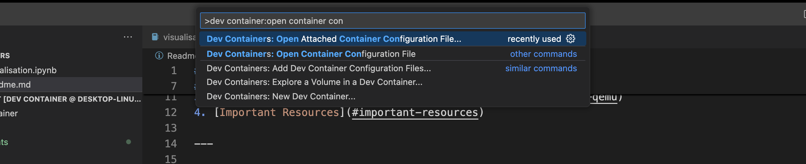

# RISC-V Project

This project demonstrates how to compile and run RISC-V C code using the RISC-V GNU toolchain and QEMU.

---

## Table of Contents

1. [Installation](#installation)
2. [Compiling RISC-V C Code](#compiling-risc-v-c-code)
3. [Running the Executable on QEMU](#running-the-executable-on-qemu)
4. [Important Resources](#important-resources)

---

## Installation

### Install RISC-V GNU Toolchain and Qemu using Docker

#### Clone this directory to desired dir and cd to dir

### Method 1
   1. Clone this repo into directory ( Make sure docker is install on your computer )
   2. Now open VsCode and type and select " Dev container:Open container configuration file "
   

   3. Now it will ask to select the folder where this repo is located on computer
   4. It will automatically setup all dependencies and requirements ( Approx 40 to 50 min )

### Method 2


#### Go to the directory and following command
```bash
   docker build -t {$ image_name} .
   docker run -it {$ image_name}
```

#### Type following command to check installation and its path

```bash

   # will show path compiler if installed properly
   which riscv64-linux-gnu-gcc

   # will show path of Qemu if installed properly
   which qemu-riscv64

```


If `riscv64-linux-gnu-` and its related tools are not available on your system, install them using the following commands:

```bash
sudo apt update
sudo apt install gcc-riscv64-linux-gnu g++-riscv64-linux-gnu
```

This will install the RISC-V GNU compiler and related tools.

---

## Compiling RISC-V C Code

To compile a C program for RISC-V, use the following command:

```bash
riscv64-linux-gnu-gcc -o {executable_file_name} {C_lang_file_name.c}
```

### Example

Compile a C program named `hello.c`:

```bash
riscv64-linux-gnu-gcc -o hello hello.c
```

This will generate an executable file named `hello`.

---

## Running the Executable on QEMU

To run the RISC-V executable on QEMU, use the following command:

```bash
qemu-riscv64 -L /usr/riscv64-linux-gnu -cpu max ./{executable_file_name}
```

### Example

Run the `hello` executable:

```bash
qemu-riscv64 -L /usr/riscv64-linux-gnu -cpu max ./hello
```

---

## Important Resources

- [RISC-V GNU Toolchain Documentation](https://github.com/riscv/riscv-gnu-toolchain)
- [QEMU Documentation](https://www.qemu.org/)
- [RISC-V Official Website](https://riscv.org/)
- [Important article on different Extension type](https://research.redhat.com/blog/article/risc-v-extensions-whats-available-and-how-to-find-it/)
- [Important guidance for latest Extension discussion](https://gitlab.com/qemu-project/qemu/-/issues/2245)
- [Article on Bit Manipulation](https://fprox.substack.com/p/risc-v-scalar-bit-manipulation-extensions)

---

## Important Note
   -  Bit manipulation: Zba, Zbb, Zbc, Zbs
   -  Crypto scalar: Zbkb, Zbkc, Zbkx, Zk*
   -  Vector (mostly complete): V, Zv*

## Example Workflow

1. Write a C program (`hello.c`):
   ```c
   #include <stdio.h>

   int main() {
       printf("Hello, RISC-V!\n");
       return 0;
   }
   ```

2. Compile the program:
   ```bash
   riscv64-linux-gnu-gcc -o ./test_example/hello ./test_example/hello.c
   ```

3. Run the program on QEMU:
   ```bash
   qemu-riscv64 -L /usr/riscv64-linux-gnu -cpu max ./test_example/hello
   ```

4. Output:
   ```
   Hello, RISC-V!
   ```


## Command to execute B extension


## Command to execute K extension
   ```bash

   riscv64-linux-gnu-gcc -o sha ./sha_code.c

   # without K extension
   qemu-riscv64 -L /usr/riscv64-linux-gnu -cpu max,zbkb=false ./sha

   # With K extension
   qemu-riscv64 -L /usr/riscv64-linux-gnu -cpu max,zbkb=true ./sha

   ```
---

## License

This project is licensed under the MIT License.


